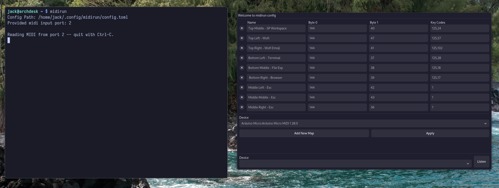

# :musical_keyboard: Midirun

**v0.2.1-beta**
_Program and daemon for using any midi controller as a macro pad on Linux._

### :star: See [Midirun Config](https://github.com/JackMechem/midirun-config) for GUI configuration tool!



## :desktop_computer: Support <a name="support"></a>

##### :penguin: Linux <a name="support-linux"></a>

- Support for Wayland and X11

## :battery: Dependencies <a name="dependencies"></a>

- [**rtmidi**](https://archlinux.org/packages/extra/x86_64/rtmidi/)
- [**jack**](https://jackaudio.org/downloads/)
- [**toml++ (tomlplusplus)**](https://archlinux.org/packages/extra/x86_64/tomlplusplus/)
- [**meson**](https://mesonbuild.com/)

## :arrow_down: Installing From AUR

```
yay -Syy midirun

# Logout and login to apply user group
sudo usermod -aG input $USER
```

## :electric_plug: Compiling and Installing <a name="comp-and-installing"></a>

### 1. Install Dependencies <a name="cai-1"></a>

##### Arch Linux <a name="cai-1-1"></a>

```
sudo pacman -S rtmidi tomlplusplus gcc cmake
```

##### Fedora Linux <a name="cai-1-2"></a>

```
sudo dnf install rtmidi-devel tomlplusplus-devel meson
```

##### Debian

```
sudo apt update
sudo apt install librtmidi-dev meson
```

### 2. Clone the Project, Compile and Install <a name="cai-2"></a>

##### Clone the Project <a name="cai-2-1"></a>

```
git clone https://github.com/JackMechem/MidiRun.git

cd MidiRun
```

##### Compile and Install <a name="cai-2-4"></a>

```
meson setup build
meson compile -C build
meson install -C build
```

### Permissions for `/dev/uinput`

MidiRun needs read and write access to `/dev/uinput` to simulate key strokes. This script creates a udev rule and gives users in the input group read and write access to `/dev/uinput`.

```
./create_udev_rule.sh

# Logout and login to apply user group
sudo usermod -aG input $USER
```

## :wrench: Usage <a name="usage"></a>

### Help Page <a name="help-page"></a>

##### Help Page

```
midirun -h
```

## Listing Midi Devices and Listen <a name="listing-io"></a>

### Listing all devices <a name="listing-io-1"></a>

```
midirun --list-io
# OR
midirun -lio
```

### Listening to a midi port <a name="listing-io-2"></a>

```
midirun -ln 2             # Replace the 2 with what ever port you are using
OR
midirun --listen 2        # Replace the 2 with what ever port you are using
```

## :car: Run as User Service (Recomended)

```
systemctl --user enable midirun
systemctl --user start midirun
```

## :taxi: Run Normally <a name="running"></a>

### Run With Default Config Path `~/.config/midirun/config.toml`

```
midirun
```

### Run With a Custom Config Path <a name="running-custom"></a>

```
midirun -c /path/to/config.toml
# or
midirun --config /path/to/config.toml
```

## :wrench: Configuration <a name="configuration"></a>

#### Default Configuration File Path <a name="configuration-default-path"></a>

```
~/.config/midirun/config.toml
```

### :star: For GUI config tool see [**midirun-config**](https://github.com/JackMechem/midirun-config) (recomended)

### Manual Configuration

#### Config Section <a name="configuration-config"></a>

The config section only contains the input port.<br />
To find the input port, see the [listing io](#listing-io-1) section.

```
[config]
inputPort = 2 # The port of your input device
```

#### Mapping Section <a name="configuration-mapping"></a>

The mapping section is composed of an array of tables named mapping. <br />

#### Overall Syntax <a name="configuration-mapping-syntax"></a>

```
[[mapping]]
name = "Top Left Button"
byte0 = 144
byte1 = 38
key = [2, 3, 4] # Key codes can be found with showkey --keycode
```
